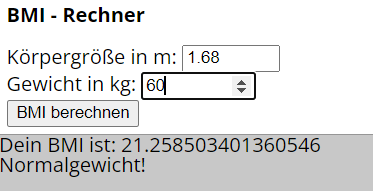
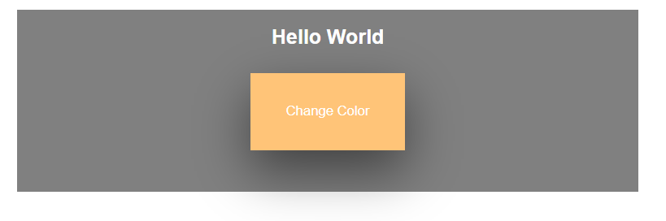
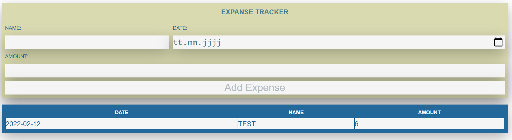
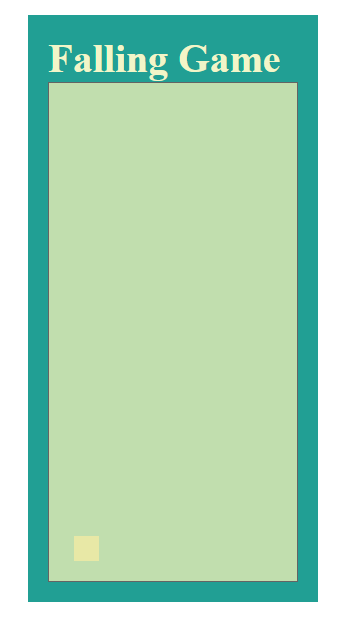
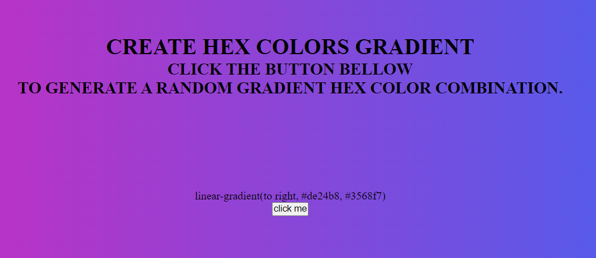
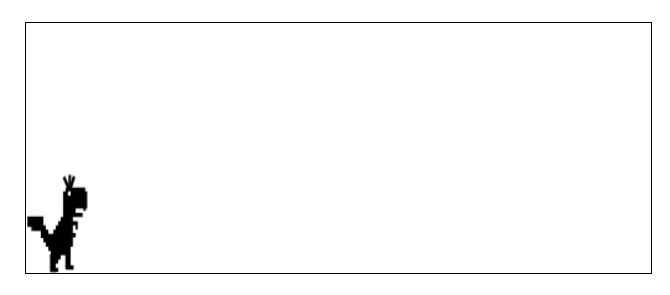
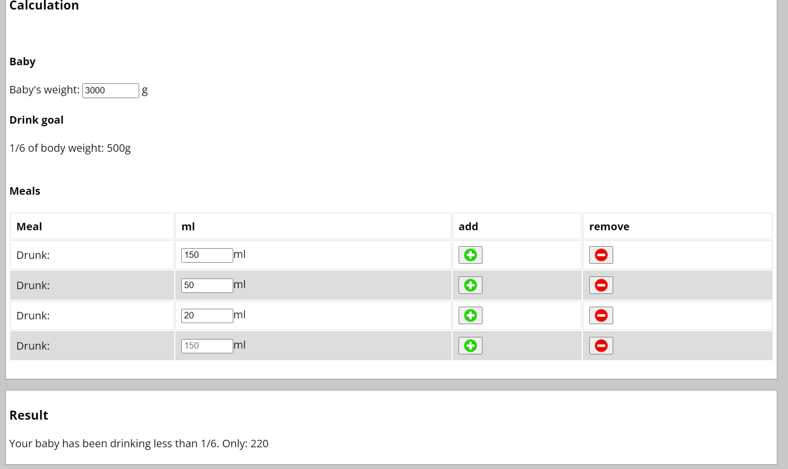
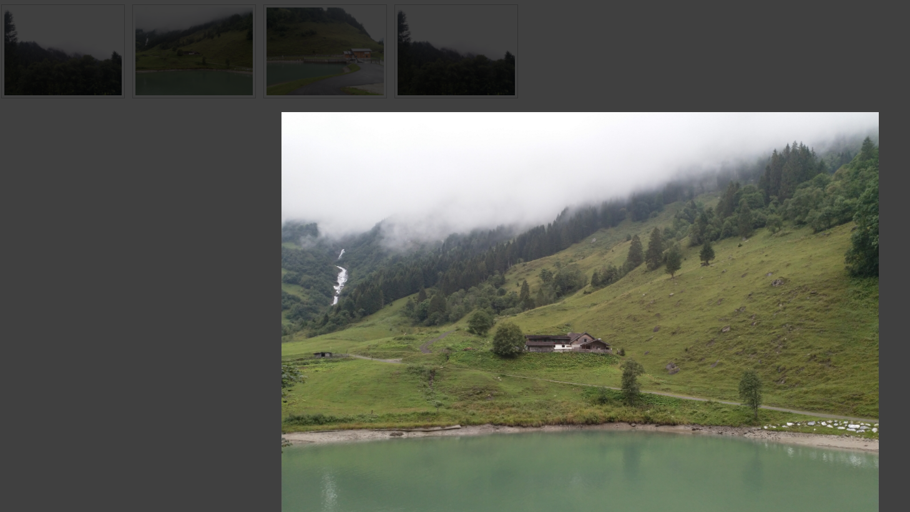
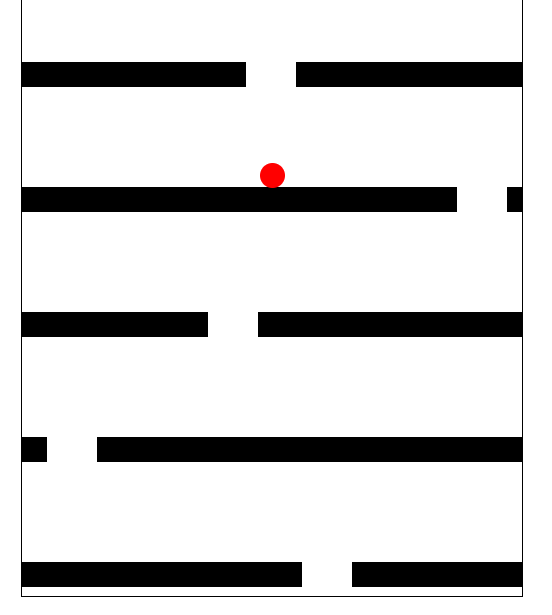
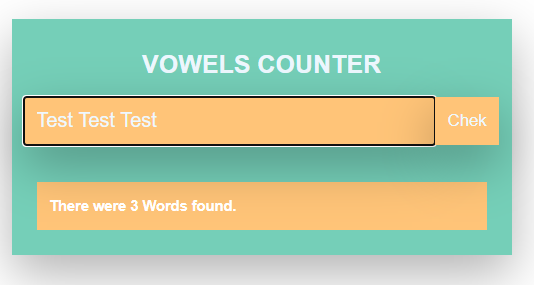

# Learn_JavaScript
A repository that I use to learn JavaScript.

## Overview

- [Overview](#overview)
  - [Goals](#goals)
  - [Projects](#projects)
  - [Links](#links)
  - [Screenshot](#screenshot)
  - [Resources](#resources)

- [Author](#author)

### Goals
With this repository I want to learn JavaScript and do as many small projects as possible.

- JavaScript
- JQuery
- Document Object Model (DOM)
- start node.js
- start Ajax

### Projects

- bmi - Body Mass Index
- change color - a small projekt to change color
- click counter - counter for clicks
- expanse - small project to add expanse
- game1 - click game
- hex color gradient - change to background to color gradient
- jumpgame - small dino jump
- baby feed - small project for baby feed
- lightbox - my lightbox project
- fall game - controll the ball
- todolist - a small todolist
- vowel counter - counter the words

### Links
- Live Site URL: [Here is my live solution](https://mklestil.github.io/Learn_JavaScript/)

### Screenshot
BMI:  
  

Change Color:  
  

Click Counter:  
  

Expanse:  
  

Game 1:  
  

Hex Color:  
  

Jumpgame:  
  

Baby Feed:  
  

Lightbox:  
  

Fall game:  
  

Todolist:  
  

Vowel Counter:  
  

### Resources
I'm just trying to use my own pictures and icons.

- Images: my personal pictures
- Icons: my personal icons

## Author

- Website - [Martin Klestil](https://github.com/mklestil)
- Twitter - [@mklestil](https://twitter.com/MKlestil)
- Linkedin - [@mklestil](https://www.linkedin.com/in/martin-klestil/)
